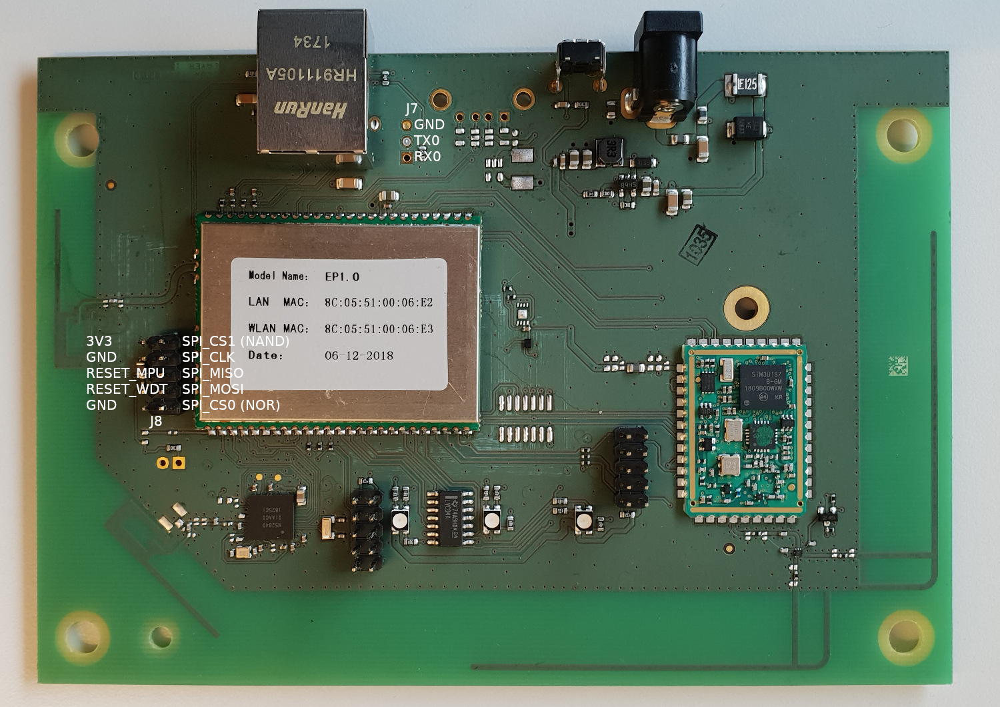
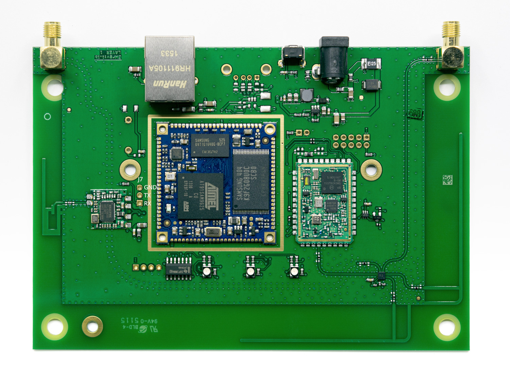

# Foreword

Please be aware that any modification to your gateway, in particular a modification of U-Boot, may permanently brick
your device and is not covered by warranty.

# Compiling the Software

## Obtaining the Source Code

The source code of this project is maintained with git.

```
git clone --recurse-submodules <repository>
cd smart-garden-gateway-public
```
Optionally, specific versions can be checked out (7.8.1 in this case):
```bash
git checkout release/linux-system-7.8.1
```

Older versions of the build system can be found in the history. However, only for the most recent master we intend to
ensure that the build works.

Source code packages for all distributed versions can be found [here](https://opensource.smart.gardena.dev/gateway/index.html).

## Prerequisites

* The Yocto build host packages need [to be installed](https://docs.yoctoproject.org/dev/ref-manual/system-requirements.html?highlight=build%20host%20package#required-packages-for-the-build-host)

## Build Instructions

### Article Number 19005 (MediaTek MT7688)

```bash
scripts/bbwrapper.sh mt7688 gardena-image-foss-bnw linux-yocto-tiny
```

### Article Number 19000 (Atmel AT91SAM)

```bash
scripts/bbwrapper.sh at91sam gardena-image-foss-bnw linux-yocto-tiny
```

## Repository Layout

* ```/``` Top level project.
    * ```/yocto/bitbake``` – the Bitbake build tool
    * ```/yocto/openembedded-core``` – OpenEmbedded core layer
    * ```/yocto/meta-mediatek``` – the MediaTek Board Support Package (BSP), used only for Art. No. 19005
    * ```/yocto/meta-distribution``` – our own distribution (specifies packages to install)
    * ```/yocto/meta-gardena``` – our own code (testing, WiFi provisioning, etc.)
    * ```/yocto/meta-openembedded``` – Collection of layers for the OE-core universe
    * ```/yocto/meta-readonly-rootfs-overlay``` – Writable rootfs overlay on top of a read-only rootfs
    * ```/yocto/meta-swupdate``` – Update mechanism software
    * ```/yocto/meta-atmel``` – our Atmel Board Support Package (BSP), used only for Art. No. 19000

# Getting access

On both versions of the gateway, the UART port can be found on J7. Settings are 115200 8N1, the level is 3.3V.

Once connected, simply follow the instructions printed during startup.

Alternatively, right after powering up a gateway, pressing the 'X' key will grant access to the U-Boot shell.

## Art. No. 19005



## Art. No. 19000



# Flashing

## Installing a Custom Image

The easiest way to install a self-built kernel and rootfs is to fetch the images over the network from within U-Boot,
using TFTP.

Ideally, the TFTP server (e.g. [tftp-hpa](https://git.kernel.org/pub/scm/network/tftp/tftp-hpa.git)) and the DHCP server
(e.g. [dnsmasq](https://thekelleys.org.uk/dnsmasq/doc.html)) run on the same machine, allowing the following steps to
work:

- Select the other boot slot: `run do_toggle_bootslot`
- Write environment to flash storage: `env save`
- Fetch kernel and rootfs over TFTP and write it to flash storage:

  **Article Number 19005 (MediaTek MT7688)**
  ```
  ubi part nand
  dhcp fitImage-gardena-sg-mt7688.bin && ubi write ${fileaddr} kernel${bootslot} ${filesize}
  dhcp gardena-image-foss-bnw-gardena-sg-mt7688.squashfs-xz && ubi write ${fileaddr} rootfs${bootslot} ${filesize}
  ```

  **Article Number 19000 (Atmel AT91SAM)**
  ```
  ubi part ubi
  dhcp fitImage-gardena-sg-at91sam.bin && ubi write ${fileaddr} kernel${bootslot} ${filesize}
  dhcp gardena-image-foss-bnw-gardena-sg-at91sam.squashfs-xz && ubi write ${fileaddr} rootfs${bootslot} ${filesize}
  ```
- Restart the gateway: `reset`

## Adding the Proprietary Bits

It is possible to install the proprietary packages via OPKG by doing the following in the Linux shell:
- Update the OPKG feeds: `opkg update`
- Install the packages:
  ```bash
  opkg install \
      accessory-server \
      cloudadapter \
      fwrolloutd \
      gateway-config-backend \
      gateway-config-frontend \
      lemonbeatd \
      lwm2mserver
  ```
- Reboot gateway: `reboot`

> [!NOTE]
> The read-write filesystem is (currently) not large enough to contain all the above packages. It is possible to resize
> the UBI volumes. However, that must be done with great care.

## Restoring the Official Image

Unless the above instructions have been performed multiple times, reverting back to the official image is as simple as
booting the previously used boot slot (from Linux):
```bash
fw_setenv bootslot $(( 1 - $(fw_printenv -n bootslot) ))
reboot
```

To install the official image through TFTP, fetch the files for the [latest release][1] from our server, e.g.

- http://gateway.iot.sg.dss.husqvarnagroup.net/archive/7.17.4/gardena-sg-mt7688/images/fitImage-gardena-sg-mt7688.bin
- http://gateway.iot.sg.dss.husqvarnagroup.net/archive/7.17.4/gardena-sg-mt7688/images/gardena-image-bnw-gardena-sg-mt7688.squashfs-xz

and follow the instructions in [Installing a Custom Image](#installing-a-custom-image). But, make sure you
reference the correct rootfs file as the names differ.

[1]: https://github.com/husqvarnagroup/smart-garden-gateway-public/tags
